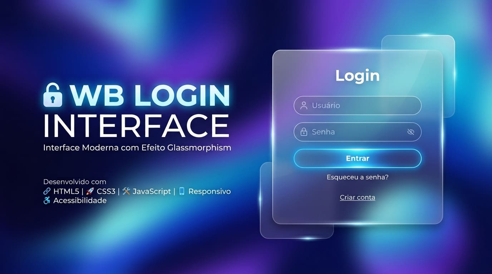
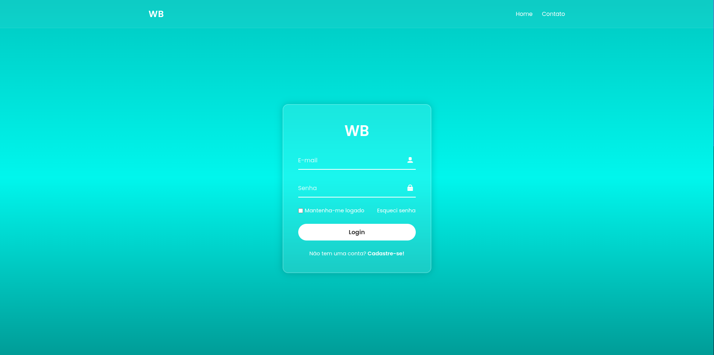

<div align="center">

<h1 align="center">WB Login Interface</h1>




</div>

<br>
<br>


<h2>Índice</h2>
<p>Navegue rapidamente pelo projeto usando o índice.</p>

* [Descrição do projeto](#descrição)
* [Funcionalidades](#funcionalidades)
* [Imagens](#imagens)
* [Ferramentas utilizadas](#ferramentas-utilizadas)
* [Acesso ao projeto](#acesso-ao-projeto)


## Descrição

Projeto desenvolvido para aplicar conceitos que estive aprendendo durante aulas do <a href="https://www.cursoemvideo.com/" target="_blank">Curso em Vídeo</a> do **Módulo 03 de HTML5 e CSS3** e o **curso de JavaScript**. O projeto visa aplicar conhecimentos de HTML, CSS e JS que foram aprendidos durante o curso.  
<br>
Consiste em uma interface de login moderna e elegante, desenvolvida com a técnica de Glassmorphism. O projeto foca em uma estética limpa, utilizando transparências e desfoque para criar um visual sofisticado.


## Funcionalidades


* **Glassmorphism Design:** Efeito de desfoque de fundo (`backdrop-filter`) que se adapta ao papel de parede.
* **Feedback Interativo:** O botão de login reage ao clique com estados visuais controlados por classes CSS.
* **Arquitetura BEM:** CSS organizado seguindo a metodologia Block-Element-Modifier para melhor manutenção.
* **Responsividade Total:** Interface otimizada para dispositivos móveis (Mobile-Friendly).
* **Acessibilidade (A11y):** Implementação de labels e suporte para leitores de tela (SR-only).
* **Animações de Transição:** Suavidade ao passar o mouse (hover) e ao focar nos campos de entrada.

## Imagens




## Ferramentas utilizadas


* **HTML5**: Estrutura semântica e acessível.
* **CSS3**: Estilização avançada com BEM, Glassmorphism e Flexbox.
* **JavaScript**: Lógica de simulação de login e manipulação de estados via classes.

## Acesso ao projeto

Você pode acessar esse projeto de algumas maneiras: 


**1ª Acessar ou baixar o código fonte pelo GitHub**

- Clique <a href="https://github.com/williambrito55/tela-login">aqui</a> para acessar o código fonte.
- Ou faça o <a href="https://github.com/williambrito55/tela-login/archive/refs/heads/master.zip">download</a> do arquivo .zip em seu dispositivo. 

<br>

**2ª Clonar o repositório e acessar o código fonte pela máquina**

- No seu terminal de preferência escolha uma pasta para download usando o comando ```cd```.
- Execute o seguinte comando e aguarde o download do repositório:  

```bash
   git clone https://github.com/William-Brito-Dev/tela-login.git
```
- Acesse a pasta onde você escolheu baixar o arquivo. Lá estará todos os arquivos do projeto.

<br>

**3ª Acesse o link do projeto em produção**

- Clique <a href="https://tela-login-projeto.vercel.app/"> aqui </a> para ir para ver o projeto funcionando


